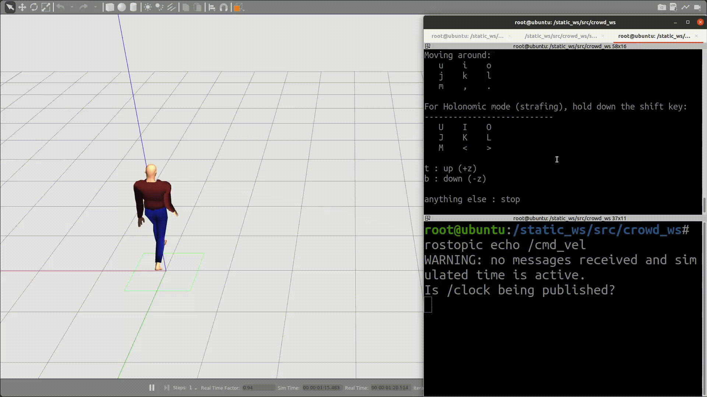
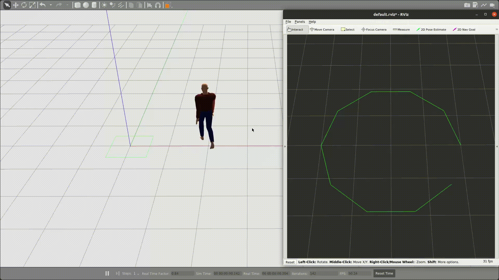
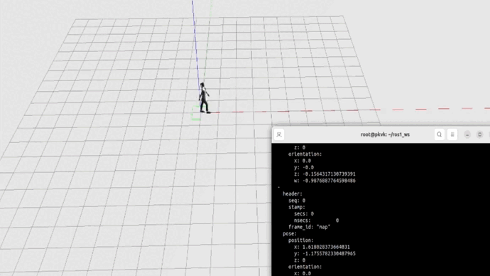

# Gazebo ROS Actor Plugin

## About

The `gazebo_ros_actor_plugin` package contains a plugin for Gazebo Classic (Version 11) and a ROS package that enables dynamic control of actors in Gazebo. The plugin allows you to control actors using either position or velocity commands.

## System Requirements

Before using this package, make sure that you meet the following requirements:

- ROS 1 Noetic 
- Gazebo Classic (Version 11)
- gazebo_ros_pkgs 

## Installation

If you want to use this package with a Docker container, follow these steps:

1. Build the Docker image using `docker build -t bcr_ros-noetic_gz-11:latest .`
2. Launch the container by running `cd docker_scripts` and `./launch_container.sh`. This will mount the package to `/root/ros2_ws/src/`.
3. To enter a bash session, run `./bashing_container.sh`.
4. To stop the container, run `./stop_container.sh`.

## Usage

### Running the gazebo_ros_actor_plugin

To use the gazebo_ros_actor_plugin, follow these steps:

1. Build the package using `catkin_make`.
2. Source `setup.bash` for the workspace containing this package.
3. Edit the parameters in the `move_actor.world` file and choose the method of subscription using the `follow_mode` tag corresponding to the plugin of the actor `actor1`. It could be either subscribing to path or velocity commands. 
4. Launch the `sim.launch` file by running:

    roslaunch gazebo_ros_actor_plugin sim.launch

### Running the Publishers

To use the plugin, you need to start a publisher that sends velocity or path commands to the actor. This package includes two example publishers:

### Velocity Publisher

To run this publisher, enter the following command:

    rosrun teleop_twist_keyboard teleop_twist_keyboard.py

Then give keyboard inputs to command linear and angular velocities. This publisher is based on the `ros-noetic-teleop-twist-keyboard` package.

### Path Publisher

To run this publisher, enter the following command after sourcing the workspace:

    rosrun gazebo_ros_actor_plugin path_publisher.py

Note that the `path_publisher.py` file can be found in the `/scripts` directory in the package.

### Working with different skins

To work with different skins on the actor change the `default_rotation` parameter in the world file to adjust the actor.

## Parameters in `move_actor.world`

The `move_actor.world` file contains the following parameters:

- `follow_mode`: The mode in which the actor will follow the commands. It can be set to either `path` or `velocity`.
- `vel_topic`: The name of the topic to which velocity commands will be published. The default topic name is `/cmd_vel`.
- `path_topic`: The name of the topic to which path commands will be published. The default topic name is `/cmd_path`.
- `animation_factor`: Multiplier to base animation speed that adjusts the speed of both the actor's animation and foot swinging.
- `linear_tolerance`: Maximum allowed distance between actor and target pose during path-following.
- `linear_velocity`: Speed at which actor moves along path during path-following.
- `angular_tolerance`: Maximum allowable difference in orientation between actor's current and desired orientation during rotational alignment.
- `angular_velocity`: Speed at which actor rotates to achieve desired orientation during rotational alignment.
- `default_rotation`: Angle offset for skin collada files. It's set to 1.57 by default but should be adjusted for the skin. It can be changed by adding or subtracting pi/2 to make the actor stand upright. For "DoctorFemaleWalk" actor, the value is "0".

## ROS API

The `gazebo_ros_actor_plugin` subscribes to information from the following inbound topics:

- `/cmd_vel`: to receive linear and angular velocity commands
- `/cmd_path`: to receive path commands

Note that the names of the topics can be overridden in the `move_actor.world` file present in this package's `/config` directory.

## Additional Resources

For more detailed information and examples, please refer to the following resources:

- [Detailed Article](https://blackcoffeerobotics.com/blog/ros-plugin-to-control-actors-in-gazebo-simulation): This article provides in-depth support and explanation of the contents of this repository.
- [Demo Videos](https://youtube.com/playlist?list=PL_jbb--NzdcAPhl06Fey7m6UO2aNw8a8d): This video playlist demonstrates Actor Plugin in action and also shows potential use case of this work, showcasing crowd behavior.

## References

Here are some additional references that may be useful:

- [Gazebo Actor Tutorial](http://classic.gazebosim.org/tutorials?tut=actor&cat=build_robot)
- [Writing a Gazebo Plugin Tutorial](https://classic.gazebosim.org/tutorials?cat=write_plugin)
- [Gazebo Actor API Documentation](http://osrf-distributions.s3.amazonaws.com/gazebo/api/dev/classgazebo_1_1physics_1_1Actor.html)
