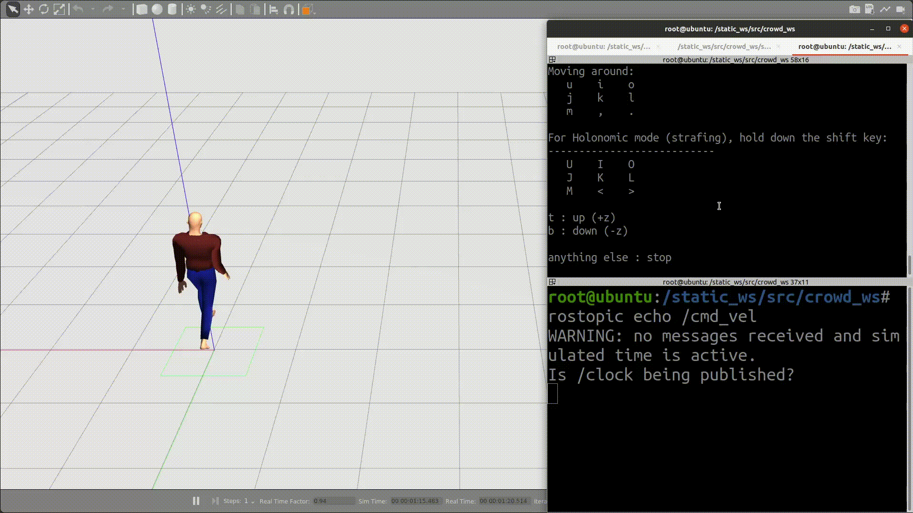
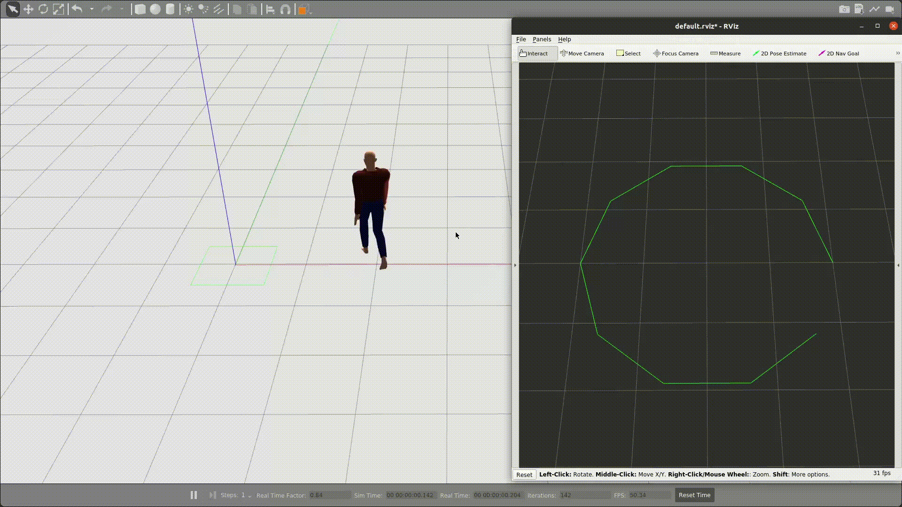

# Gazebo ROS2 Actor Plugin (Fortress)

## About

The `gazebo_ros_actor_plugin` package contains a plugin for **Gazebo Fortress** and **ROS2 Humble** that enables dynamic control of actors in simulation. The plugin allows you to control actors using either pose array or velocity commands.

The ROS2 port of this plugin has been generously sponsored by [Eric Schöneberg](https://github.com/Scoeerg)

## System Requirements

Before using this package, make sure that you meet the following requirements:

- **ROS 2 Humble** 
- **Gazebo Fortress** (gz-sim6)
- **ros_gz** packages (`ros_gz_sim`, `ros_gz_bridge`)
- **Ubuntu 22.04** (recommended)

## Installation

### Prerequisites

```bash
# Install ROS2 Humble (Ubuntu 22.04)
# Follow official instructions at: https://docs.ros.org/en/humble/Installation.html


# Install Gazebo and ROS-Gazebo bridge packages
sudo apt-get install ros-humble-ros-gz ros-humble-ros-gz-bridge ros-humble-ros-gz-sim
```

### Build from Source

```bash
# Create a ROS2 workspace
mkdir -p ~/ros2_ws/src
cd ~/ros2_ws/src

# Clone this repository
git clone https://github.com/blackcoffeerobotics/gazebo-ros-actor-plugin.git -b humble-fortress

# Install dependencies
cd ~/ros2_ws
rosdep install --from-paths src --ignore-src -r -y

# Build the package
colcon build --packages-select gazebo_ros_actor_plugin

# Source the workspace
source ~/ros2_ws/install/setup.bash
```

### Docker Installation (Alternative)

If you prefer using Docker:

```bash
# Build the Docker image
docker build -t bcr_ros2-humble_gz-fortress:latest .

# Launch the container
cd docker_scripts
./launch_container.sh

# Enter the container shell
./bashing_container.sh

# Inside the container, build the workspace
cd /root/ros2_ws
colcon build --packages-select gazebo_ros_actor_plugin
source install/setup.bash

# To stop the container
./stop_container.sh
```

## Usage

### Running the Plugin

1. **Source your workspace:**
   ```bash
   source ~/ros2_ws/install/setup.bash
   ```

2. **Configure the actor mode** in `config/worlds/move_actor.world`:
   - Edit the `follow_mode` parameter to either `velocity` or `path`

3. **Launch the simulation:**
   ```bash
   ros2 launch gazebo_ros_actor_plugin sim.launch.py
   ```

   Launch arguments:
   - `verbose:=True/False` - Enable verbose output (default: True)
   - `headless:=True/False` - Run without GUI (default: False)


### Control Methods

#### 1. Velocity Control

```bash
# Install teleop keyboard
sudo apt-get install ros-humble-teleop-twist-keyboard

# Run teleop
ros2 run teleop_twist_keyboard teleop_twist_keyboard
```

Use `i/j/k/l/,` keys to control movement.



#### 2. Path Following

```bash
ros2 run gazebo_ros_actor_plugin path_publisher.py
```

Publishes a circular path with 10 waypoints.



## Configuration Parameters

| Parameter | Default | Description |
|-----------|---------|-------------|
| `follow_mode` | `velocity` | Control mode: `path` or `velocity` |
| `vel_topic` | `/cmd_vel` | Velocity command topic |
| `path_topic` | `/cmd_path` | Path command topic |
| `animation_factor` | `4.0` | Animation speed multiplier |
| `linear_velocity` | `1.0` | Movement speed (m/s) |
| `angular_velocity` | `2.5` | Rotation speed (rad/s) |
| `default_rotation` | `1.57` | Skin alignment offset (rad) |

## ROS2 API

### Subscribed Topics

- `/cmd_vel` (`geometry_msgs/msg/Twist`) - Velocity commands
- `/cmd_path` (`geometry_msgs/msg/PoseArray`) - Path waypoints

## Resources

- [Gazebo Harmonic Actors Docs](https://gazebosim.org/docs/harmonic/actors/)
- [Demo Videos](https://youtube.com/playlist?list=PL_jbb--NzdcAPhl06Fey7m6UO2aNw8a8d)
- [Detailed Article](https://blackcoffeerobotics.com/blog/ros-plugin-to-control-actors-in-gazebo-simulation)

